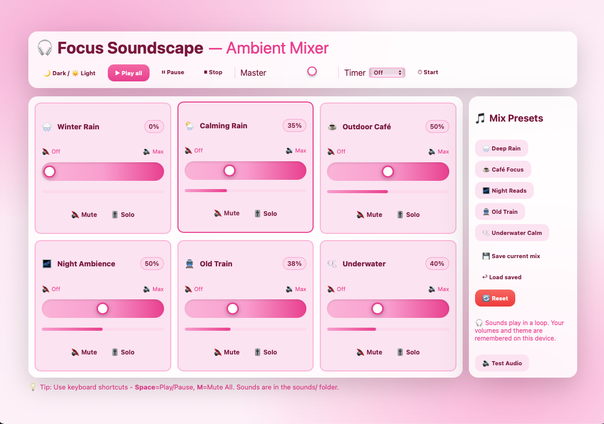
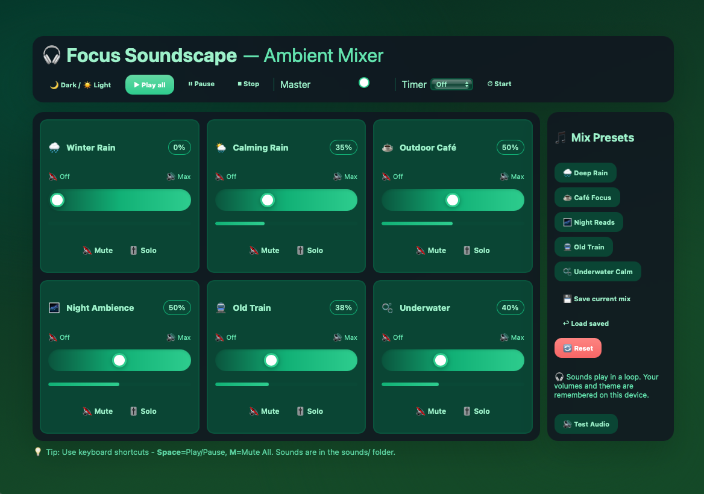

# 🎧 Focus Soundscape — Ambient Mixer

A local-first, single-page **ambient sound mixer** for focus, reading, and relaxation.
Mix different background sounds directly in your browser — no backend, no build tools.

## 📸 Screenshots

Light Mode:


Dark Mode:

## ✨ Features

* 🎚 **Per-channel controls** (volume slider / mute / solo)
* 🔊 **Master volume** — global control, Stop → smooth fade-out
* 🌙 **Light/Dark theme** — remembered in local storage
* 🧩 **Presets**:

  * 🌧 Deep Rain
  * ☕ Café Focus
  * 🌌 Night Reads
  * 🚆 Old Train
  * 🫧 Underwater Calm
* ⏱ **Sleep timer** (15 / 30 / 60 / 90 min → auto stop)
* 💾 **Save / Load / Reset** mixes
* 📦 **Fully local** — no internet, backend, or installation required


## 🚀 Quick Start

1. Place your MP3 files in the `assets/sounds/` folder.

   * Example files included:

     * `winter-rain-in-oak-forest-loop-185672.mp3`
     * `calming-rain-257596.mp3`
     * `outdoor-cafe-in-university-51657.mp3`
     * `night-ambience-17064.mp3`
     * `inside-old-train-169418.mp3`
     * `underwaterambience-181406.mp3`
2. Open `index.html` in your browser.

   * On first use, click **Play all** (autoplay is blocked by most browsers).
3. 🎶 Start mixing!


## 🕹️ Controls

* ▶️ **Play all** / ⏸ **Pause** / ⏹ **Stop**
* 🎚 **Master volume** — affects all channels
* 🔇 **Mute** / 🎚 **Solo** — per channel
* 💾 **Save / Load / Reset** — persist your own mix
* ⏱ **Timer** — fade-out and stop automatically after set time

**Keyboard shortcuts**

* **Space** → Play/Pause
* **M** → Mute/Unmute all


## 🧠 Persistence (LocalStorage)

* `fs_state_v2` → current mix (per-channel volume/mute/solo + master)
* `fs_saved_mix` → your saved mix
* `fs_theme` → theme preference

📌 All data stays on your device.


## 🔧 Customization

Add a new channel in `index.html` → `channels` array:

```js
{ id:'river', emoji:'🏞️', name:'River', file:'assets/sounds/river.mp3', vol:0.5 }
```

Edit the `PRESETS` object to define new default mixes.

## 📄 License

* Code: **MIT**
* Audio files: Original licenses apply (Pixabay, Freesound, Mixkit, etc.)
